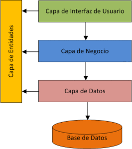

<p align="center">
  <a href="http://nestjs.com/" target="blank"></a>
</p>

[circleci-image]: https://img.shields.io/circleci/build/github/nestjs/nest/master?token=abc123def456
[circleci-url]: https://circleci.com/gh/nestjs/nest

  <p align="center">A progressive <a href="http://nodejs.org" target="_blank">Node.js</a> framework for building efficient and scalable server-side applications.</p>
    <p align="center">
<a href="https://www.npmjs.com/~nestjscore" target="_blank"></a>
<a href="https://www.npmjs.com/~nestjscore" target="_blank"></a>
<a href="https://www.npmjs.com/~nestjscore" target="_blank"></a>
<a href="https://circleci.com/gh/nestjs/nest" target="_blank"></a>
<a href="https://coveralls.io/github/nestjs/nest?branch=master" target="_blank"></a>
<a href="https://discord.gg/G7Qnnhy" target="_blank"></a>
<a href="https://opencollective.com/nest#backer" target="_blank"></a>
<a href="https://opencollective.com/nest#sponsor" target="_blank"></a>
  <a href="https://paypal.me/kamilmysliwiec" target="_blank"></a>
    <a href="https://opencollective.com/nest#sponsor"  target="_blank"></a>
  <a href="https://twitter.com/nestframework" target="_blank"></a>
</p>
  <!--[](https://opencollective.com/nest#backer)
  [](https://opencollective.com/nest#sponsor)-->

## Descripción

[Nest](https://github.com/nestjs/nest) API para personajes, episodios y apariciones de Rick and Morty.

# Estado
En contrucción.

# Tecnologías Utilizadas

## Backend
Esta basado en el principio de Clean Architecture, con una arquitectura de capas.


### Estructura de paquetes

Se definió la siguiente taxonomía de paquetes:

* **domain:** Contiene las entidades y lógica de negocio fundamental.
* **dto:** Define los objetos que son transferidos entre las capas de la aplicación.
* **modulos:** Los modulos con sus capas service y controller. Aqui, llamados 'task*'
    * **service:** Contiene la lógica de negocio y operaciones complejas.
    * **controller:** Maneja las solicitudes HTTP.



## Base de datos
- Se usa postgreSQL 15.

## Instalación del entorno de Nest

```bash
$ npm install
```

## Ejecutar la aplicación

```bash
# development
$ npm run start

# watch mode
$ npm run start:dev

# production mode
$ npm run start:prod
```

## Test

```bash
# unit tests
$ npm run test

# e2e tests
$ npm run test:e2e

# test coverage
$ npm run test:cov
```

## Soporte Nest

Nest is an MIT-licensed open source project. It can grow thanks to the sponsors and support by the amazing backers. If you'd like to join them, please [read more here](https://docs.nestjs.com/support).

## Notas Adicionales

- El archivo rickmorty.sql contiene datos básicos para hacer una ejecución elemental de la aplicación.
- El archivo Prisma.postman_collection.json es una colección de postman con los curl de los servicios expuestos.

# Autor
[<br><sub>Juan Salas</sub>](https://github.com/jsalas87)


